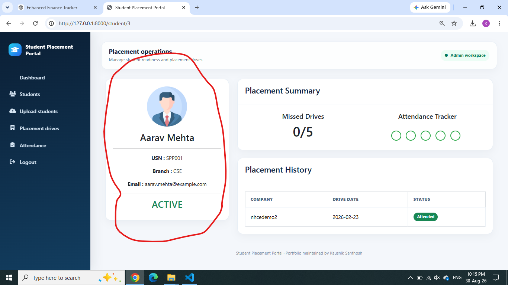

# Student Placement Portal


A full-stack placement management application that keeps student records, placement drives, attendance, eligibility, and student access synchronized between dedicated administrator and student portals.

This repository contains the portfolio version maintained and extended by **Kaushik Santhosh**.

## Application preview



## Why this project exists

Placement information is often distributed across spreadsheets, messages, and manually maintained attendance records. This project brings those workflows into one system so administrators can manage placement activity while students can independently track their profiles, eligibility, and drive history.

## Core features

### Administrator workspace

- Dashboard with student, company, active, and debarred counts
- CSV and Excel-based bulk student onboarding
- Automatically generated temporary student credentials
- Temporary-password reveal and secure password-reset workflow
- Searchable student directory with attendance indicators
- Complete student profile, placement history, and eligibility view
- Student editing for USN, name, email, branch, and status
- Confirmed student deletion with linked-record cleanup
- Placement-drive creation, editing, rescheduling, and deletion
- Drive attendance recording and historical attendance review
- Automatic missed-drive tracking and debarment after five misses

### Student workspace

- Secure student login and compulsory first-login password change
- Personal dashboard with eligibility and missed-drive progress
- Latest-five-drive attendance tracker
- Placement-drive list with upcoming/completed status
- Personal attendance and placement history
- Profile information synchronized with administrator updates

### Data consistency and safety

- Passwords are stored using Werkzeug password hashing
- Student-selected passwords are never shown to administrators
- Only active temporary passwords can be revealed
- Sensitive administrator actions use POST requests and session CSRF tokens
- Deleting a student removes connected attendance, feedback, attempts, notifications, and placement results
- Deleting a drive removes its attendance/history and recalculates student missed-drive totals
- Stable student-session IDs keep both portals synchronized when profile information changes
- Environment credentials and runtime uploads are excluded from version control

## Technology stack

| Layer | Technology |
| --- | --- |
| Backend | Python 3.12, Flask |
| Database | MySQL 8, PyMySQL |
| Data import | pandas, openpyxl, xlrd |
| Frontend | Jinja2, Bootstrap 5, HTML, CSS, JavaScript |
| Security | Werkzeug password hashing, session-based authorization, CSRF tokens |
| Testing | Python `unittest`, Flask test client |

## Project structure

```text
student-placement-portal/
├── app.py                     # Flask routes and application logic
├── database/
│   └── schema.sql             # MySQL schema and relationships
├── sample_data/
│   ├── students_template.csv  # Minimal import template
│   └── students_30_demo.csv   # Fictional 30-student demo dataset
├── static/
│   ├── css/                   # Responsive visual system
│   └── js/                    # Client-side interactions
├── templates/                 # Administrator and student pages
├── tests/                     # Functional regression tests
├── uploads/                   # Runtime files; contents are ignored
├── .env.example               # Safe environment-variable template
└── requirements.txt           # Python dependencies
```

## Local installation

### Prerequisites

- Python 3.12
- MySQL Server 8
- MySQL Workbench
- Git

Python 3.12 is recommended because the pinned dependency range provides reliable Windows wheels for pandas and NumPy.

### 1. Clone the repository

```bash
git clone https://github.com/Kaushik-web-arch/student-placement-porta.git
cd student-placement-porta
```

### 2. Create a virtual environment

Windows PowerShell:

```powershell
py -3.12 -m venv .venv
Set-ExecutionPolicy -Scope Process -ExecutionPolicy Bypass
.\.venv\Scripts\Activate.ps1
```

macOS or Linux:

```bash
python3.12 -m venv .venv
source .venv/bin/activate
```

### 3. Install dependencies

```bash
python -m pip install --upgrade pip
pip install -r requirements.txt
```

### 4. Create the MySQL database

Open `database/schema.sql` in MySQL Workbench and execute the complete script. It creates the `placement_portal` database, tables, relationships, and local demo administrator.

### 5. Configure environment variables

Windows PowerShell:

```powershell
Copy-Item .env.example .env
```

macOS or Linux:

```bash
cp .env.example .env
```

Update `.env` with your local MySQL password and a private Flask secret key:

```env
DB_HOST=localhost
DB_PORT=3306
DB_USER=root
DB_PASSWORD=your_mysql_password
DB_NAME=placement_portal
SECRET_KEY=your_private_random_secret
FLASK_DEBUG=true
PORT=8000
```

Generate a secret key with:

```bash
python -c "import secrets; print(secrets.token_hex(32))"
```

Never commit the generated `.env` file.

### 6. Run the application

```bash
python app.py
```

Open [http://127.0.0.1:8000](http://127.0.0.1:8000).

## Local demonstration

The database script includes a local-only administrator account:

```text
Username: admin
Password: admin123
```

Change the demonstration credentials before using the application outside a local development environment.

To test student onboarding, sign in as the administrator and upload `sample_data/students_30_demo.csv`. The records and email addresses in this file are fictional. Save the generated temporary passwords when they are displayed.

## Running the tests

```bash
python -m unittest discover -s tests -v
```

The regression suite covers:

- Student password reset and first-login password replacement
- Student edit synchronization across both portals
- Student deletion and active-session invalidation
- Placement-drive editing and student-side synchronization
- Placement-drive deletion and attendance-total recalculation
- CSRF validation and confirmation controls

Current result: **11 tests passing**.

## Privacy notes

- Do not upload real student spreadsheets or personally identifiable data.
- Do not commit `.env`, MySQL credentials, generated passwords, or runtime uploads.
- The included sample dataset uses fictional records and `example.com` addresses.

## Future improvements

- Role-based administrator permissions
- Email delivery for temporary credentials and drive notifications
- Placement analytics and exportable reports
- Cloud database deployment and production secret management
- CI workflow for automated test execution

## Maintainer

**Kaushik Santhosh**  
Computer Science (Data Science) undergraduate  
GitHub: [Kaushik-web-arch](https://github.com/Kaushik-web-arch)

## License

This project is available under the [MIT License](LICENSE).
